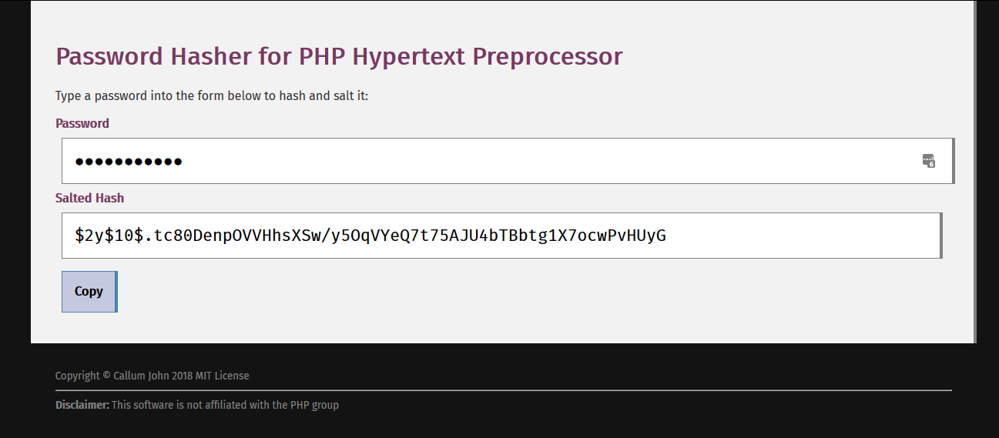

# PHPHP
Password Hasher for PHP Hypertext Preprocessor

## About
When writing PHP applications that store passwords, there will be times where
you need a password hash that is compatible with `password_verfiy`.
Without the command line, there was no easy way to do this
